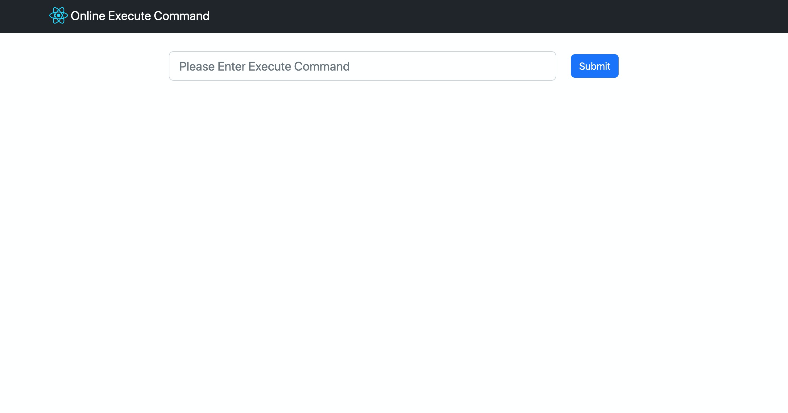
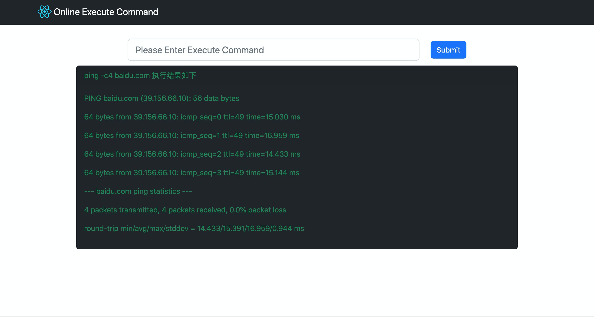
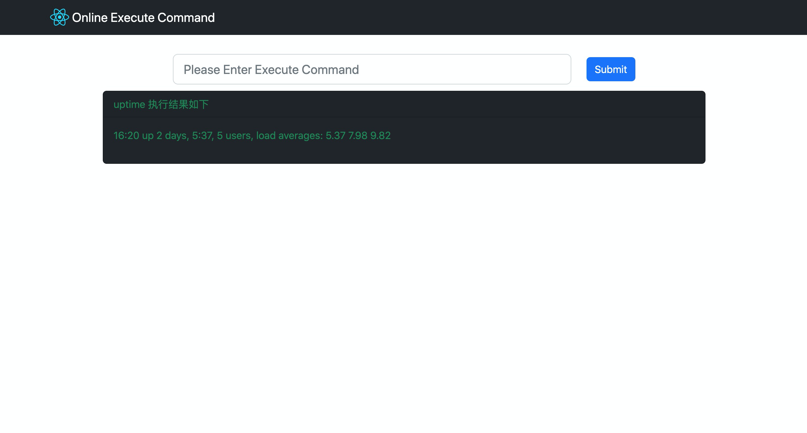
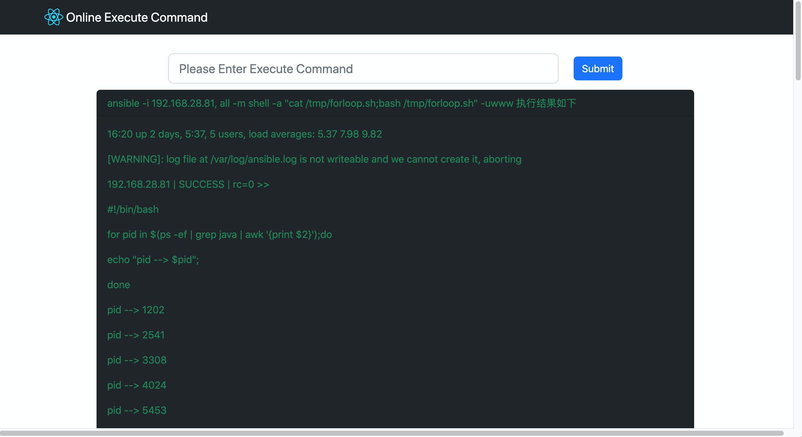

GIN  + React + Vite 实现websocket的demo

# 研究原因

- 看别人的实现觉得很牛逼(类似Jenkins的日志输出)，自己模(抄)仿(袭)下来感觉确实很牛逼，牛逼到自己都看不懂对应的代码，尤其是React写的懵逼的不要不要的
- 这只能是一个小demo, 玩具级别的都算不上

# Demo

> ping



> ping



> uptime



> ansible



# Server

- Gin + gorilla/websocket 实现，其实是抄的 gorilla 官方的 Example

# Client

- Vite + React + bootstrap 实现

# 使用

> 后端启动

```python
cd gin-react-websocket/server
go run main.go

```

> 前端启动

```python
cd gin-react-websocket/client
yarn dev

```

# Note

- 如果你自定义了server端的ip和端口，记得修改client/.env文件
